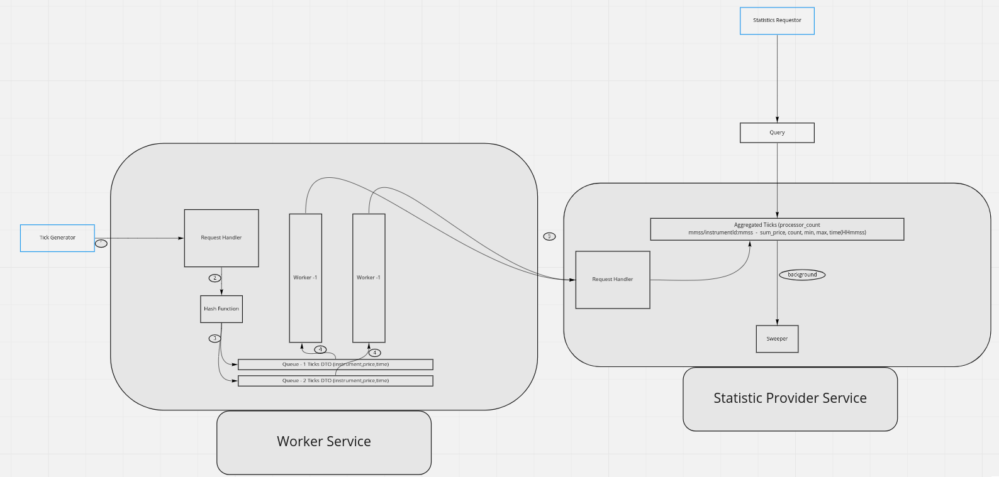

# Data Collector Service

## How to Run

Please note that the service runs on default port **10001**. Two options to start the application

1. To make the service up this port needs to be free
2. Change ```server.port``` property of ```data-collector-service/src/main/resources/application.properties``` file to
   up in any port.

### Get the source code

1. Get source from git repository [https://github.com/mbzshajib/data-collector-service](https://github.com/mbzshajib/data-collector-service)  .
2. Go to data-collector-service directory
3. Checkout main Branch ```git checkout main```

### Deploy in Local Machine

- Execute following command to start the application in local machine ```./mvnw spring-boot:run```

**Note:** _To change the port change the property ```server.port```
of ```data-collector-service/src/main/resources/application.properties``` file_

### Deploy Docker in container

Execute following commands to start the application in docker container.

1. Go to data-collector-service
2. Execute ```./mvnw clean package```
2. Execute ```docker build -t mbzshajib/data-collector-service .```
3. Execute ```docker run -p 10001:10001 mbzshajib/data-collector-service```

**Note:** need to docker installed to run in container

## Description

#### High Level Diagram

Below is high-level diagram how the problem was addressed.


- **Collector:** Collector will provide an API (```/ticks```)to handle request.
- **Hash Function** To determine the in which queue request needs to store. Currently, taking instrument and part of
  timestamp (mmss)
- **Queue** Each queue is for storing incoming request. One thread will do statistic generation job from one queue.
- **Worker** To process the queue and save to an aggregated map with key instrument-mmss-workerId and value statistical
  data.
- **Query** Query service will provide the statistic
  API (```GET /statistics and GET /statistics/{/statistics/{instrument_identifier}}```)
- **Sweeper** A sweeper thread (can be configured if requires more) will always cleanup the old (before 60 seconds) data
  from aggregated storage in background.

### Technology Used

- Programming Language Java
- JDK version to developed Java 11
- Framework Springboot version 2.6.4
- Container environment Docker
- Application server: Tomcat (embedded Apache Tomcat with springboot)

## Assumptions

- No additional helping technology will be used (e.g. queuing service like rabbitmq or in memory caching service like
  redis)
- Given that 100 exchanges, 10000 instruments. Exchanges are around the world. All exchanges will not be sending tick
  all the time
- Instrument name should be 1~256 length and readable character.
- Exchanges will not send tick for all instruments all the time when price changes of the instrument
- All the exchanges will not have all the 10000 companies
- Assume 30 exchanges active and 1000 company so 30000 tick will be recieved in 1 minutes. Thus 30000/60=500
  request/second
- Some company (popular companies) sending tick rate is high.
- Burst request can come in peak time.
- Getting statistics of few company will be too high.
- If brust request comes statistics info will be available after background processing completes

## Further Improvement

- Improve hashing technique to find the queue. It is possible if tick one company is very high and send more than queue
- Will save tick data (file/db) for future use (now sweeping out). max size then there will be overflow. So more
  improving queue will help to balance queues properly
- Require load testing and stress testing to find what is JVM behaviour and tune accordingly. if tick request for long
  time need to monitor if the GC is happening properly.
- There is scope to improve low level design (manage queue in more efficient way).
  parameters (```data-collector-service/src/main/resources/application.properties```) accordingly.
- Separate collector and accumulator service diagram below to make the system scalable. In current implementation it is
  not. Current design support to extend and make scalable



- Need to monitor and find if this service can handle burst request
- If I could use other technology I would use stream services(e.g. kafka), and in memory caching services to get better
  performance
- Need to write more test cases covering more scenario.
- Since this is memory hungry service (due to O(1)/constant read), moving to reactive pattern (springboot reactive) will
  utilize resources in a better way. Application will be more resilient on huge request.

## Regarding the Challenge

- Very interesting challenge.
- It was a combination of memory management, Multi threading and Concurrency challenges which we face separately.

## API HTTP Request

### API 1: POST /tick (application/json)

```
POST /ticks HTTP/1.1
Host: localhost:10001
Content-Type: application/json

{
	"instrument":"ACD",
	"price":	0.2,
	"timestamp": 1646774304498
}
```

### API 2: GET /statistics

```
GET /statistics HTTP/1.1
Host: localhost:10001
```

### API 3: GET /statistics/{instrument_identifier}

```
GET /statistics/{instrument_identifier} HTTP/1.1
Host: localhost:10001/statistics/{instrument_identifier}
```