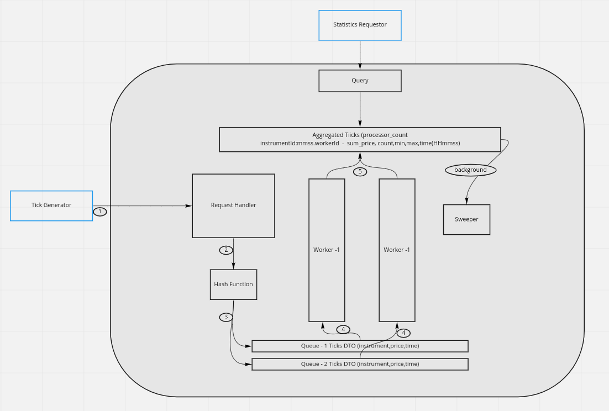

# Data Collector Service

## How to Run

Please note that the service runs on default port **10001**. Two options to start the application

1. To make the service up this port needs to be free
2. Change ```server.port``` property of ```data-collector-service/src/main/resources/application.properties``` file to
   up in any port.

### Get the source code

1. Execute command ```git clone git@github.com:mbzshajib/data-collector-service.git (ssh)```
2. Go to data-collector-service directory
3. Checkout main Branch ```git checkout main```

### Deploy in Local Machine

- Execute following command to start the application in local machine ```./mvnw spring-boot:run```

**Note:** _To change the port change the property ```server.port```
of ```data-collector-service/src/main/resources/application.properties``` file_

### Deploy Docker in container

Execute following commands to start the application in docker container.

1. Go to data-collector-service
2. Execute ```docker build -t mbzshajib/data-collector-service .```
3. Execute ```docker run -p 10001:10001 mbzshajib/data-collector-service```

**Note:** need to docker installed to run in container

## Description

#### Current Diagram

Below is high-level diagram how the problem was addressed.



- **Collector:** Collector will provide an API (```/ticks```)to handle request.
- **Hash Function** To determine the in which queue request needs to store. Currently, taking instrument and part of
  timestamp (mmss)
- **Queue** Each queue is for storing incoming request. One thread will do statistic generation job from one queue.
- **Worker** To process the queue and save to an aggregated map with key instrument-mmss-workerId and value statistical
  data.
- **Query** Query service will provide the statistic
  API (```GET /statistics and GET /statistics/{/statistics/{instrument_identifier}}```)
- A sweeper thread (can be configured if requires more) will always cleanup the old (before 60 seconds) data from aggregated storage in background.
## Assumptions

## Further Improvement


## Regarding the Challenge

```
curl -X POST \
  http://localhost:10001/ticks \
  -H 'cache-control: no-cache' \
  -H 'content-type: application/json' \
  -H 'postman-token: ff05a838-d78d-12fe-b4b6-d1d7ae9c393d' \
  -d '{
	"instrument":"ABCD",
	"price":	100.2,
	"timestamp": 1646750696170
}'
```